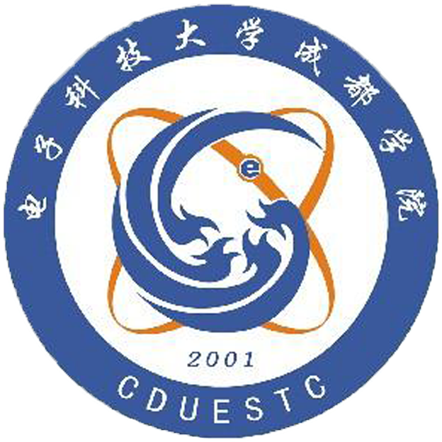
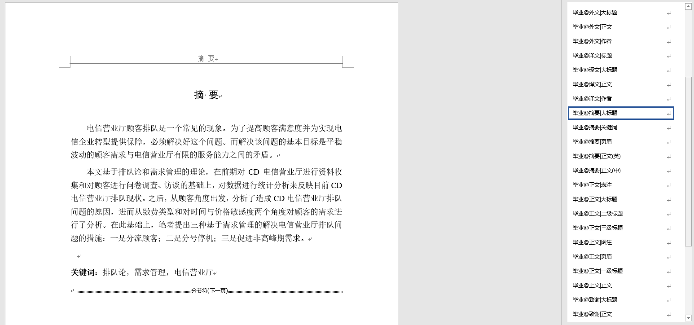
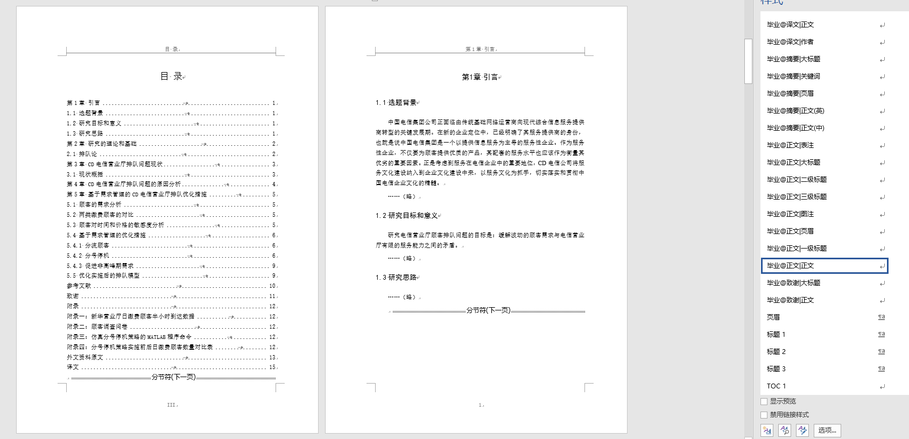
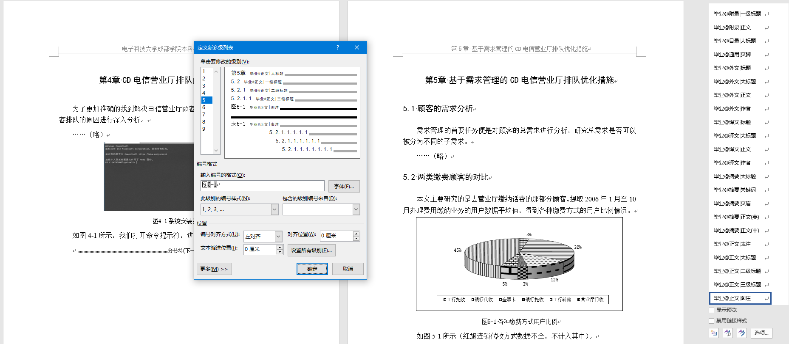

  

# 电子科技大学成都学院 - 报告模板

## 🌱 简介

该模板为电子科技大学成都学院毕业设计所用，根据 2021 年教务处所发规范，重制新的模板，修正了教务所发模板中格式错误，使用繁琐的 bug，将所有文字添加样式，学生只需要选择样式即可快速调整样式，方便快捷。

## 📥 下载地址

在 files 文件夹中，选择有需求的模板，选择右上角的`download`下载

或者直接点击右上角的【Code-Download ZIP】下载本项目全部文件

## 🗃️ 模板库

- 毕业设计 [规范](files/毕业设计+课程设计/毕业论文格式规范.md)
- 课程设计 [规范](files/毕业设计+课程设计/课程设计格式规范.md)
- 项目设计报告 [规范](files/项目设计报告/项目设计报告格式规范.md)
- 工程项目设计 [规范](files/工程项目设计/工程项目设计格式规范.md)

## 🎨 样式库

- 摘要
  - 毕业@摘要|页眉
  - 毕业@摘要|大标题
  - 毕业@摘要|正文(中)
  - 毕业@摘要|正文(英)
  - 毕业@摘要|关键词
- 目录
  - 毕业@目录|大标题
- 正文
  - 毕业@正文|页眉
  - 毕业@正文|大标题
  - 毕业@正文|一级标题
  - 毕业@正文|二级标题
  - 毕业@正文|三级标题
  - 毕业@正文|正文
  - 毕业@正文|图注
  - 毕业@正文|表注
  - 毕业@通用|页脚
- 参考文献
  - 毕业@参考|大标题
  - 毕业@参考|正文
- 致谢
  - 毕业@致谢|大标题
  - 毕业@致谢|正文
- 附录
  - 毕业@附录|大标题
  - 毕业@附录|一级标题
  - 毕业@附录|正文
- 外文资料/译文
  - 毕业@外文|标题
  - 毕业@外文|大标题
  - 毕业@外文|作者
  - 毕业@外文|正文
  - 毕业@译文|标题
  - 毕业@译文|大标题
  - 毕业@译文|作者
  - 毕业@译文|正文

## 🌐 演示

## 🔨 贡献

非常欢迎你可以为本模板提出贡献，也十分感谢你的反馈。
